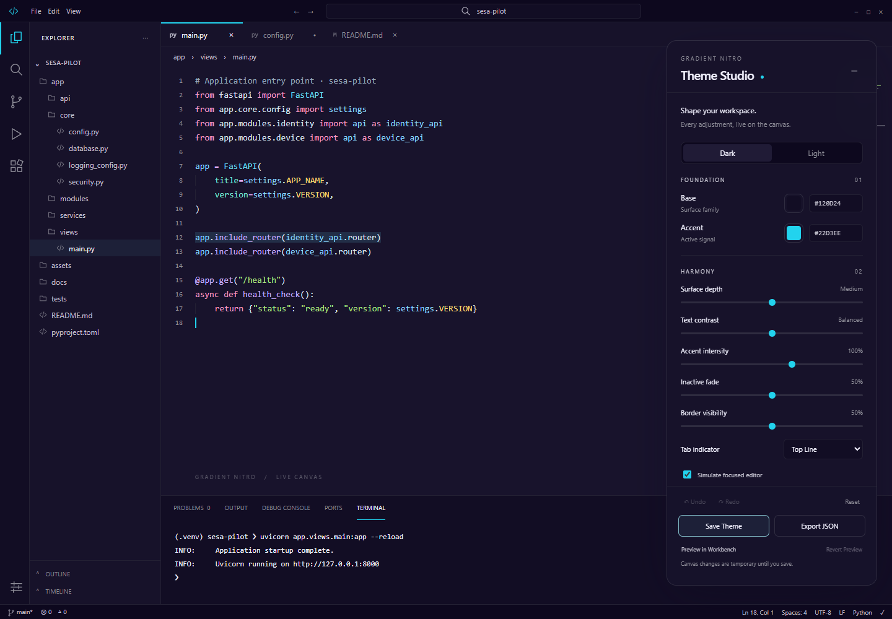
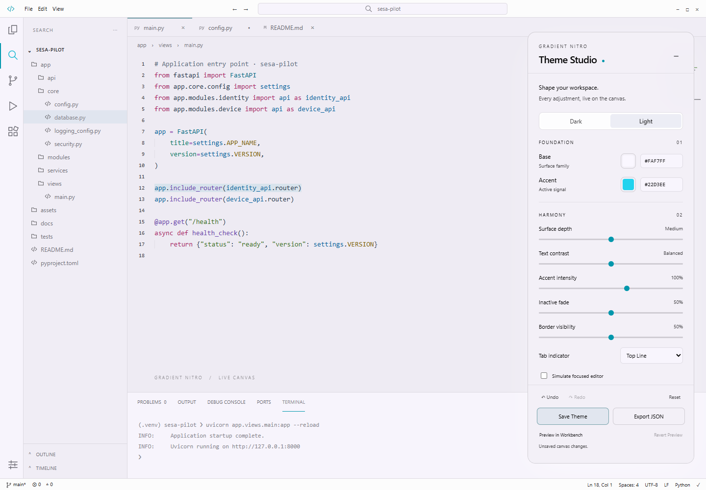
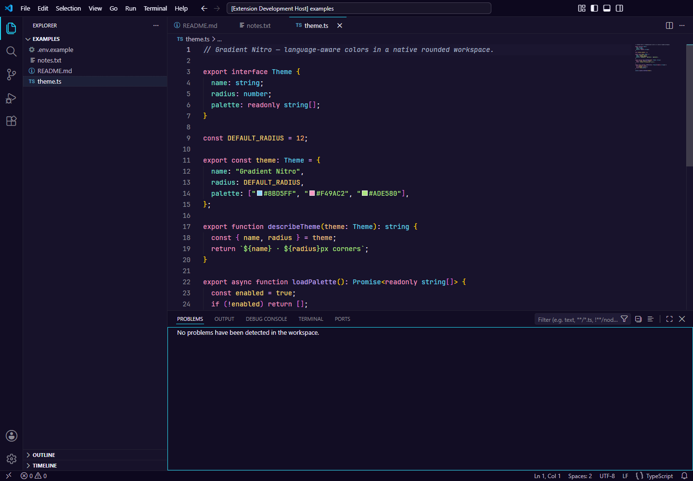
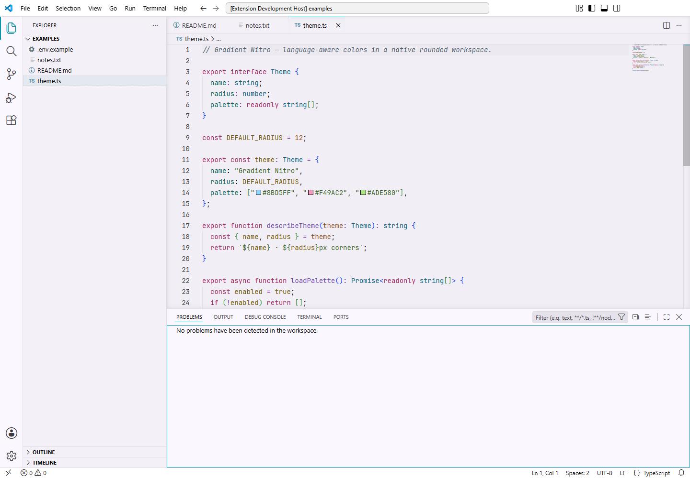
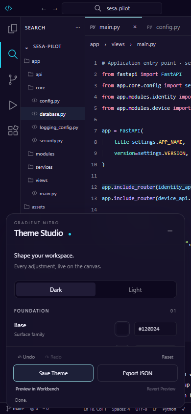

# Gradient Nitro Glass

A calm purple workspace with colorful syntax and an interactive Theme Studio. Refine the workbench from **Base + Accent**, with thin active indicators and a live canvas that responds immediately.

**Version 1.4.0 · Tested on VS Code 1.136.1**

[Marketplace](https://marketplace.visualstudio.com/items?itemName=dadayan1234.gradient-nitro-glass) · [Issues](https://github.com/dadayan1234/gradient-nitro/issues) · [Changelog](CHANGELOG.md)

## Install and try 1.4.0

1. Open the Command Palette and run **Extensions: Install from VSIX…**.
2. Choose `gradient-nitro-glass-1.4.0.vsix` from the project folder. Reload VS Code if prompted.
3. Run **Preferences: Color Theme** and select **Gradient Nitro Glass** or **Gradient Nitro Glass Light**.
4. Run **Gradient Nitro: Open Theme Customizer**. Changes appear on the canvas immediately; click **Save Theme** to persist them.

Upgrading retains your saved settings. To try the new default palette and indicator hierarchy, click **Reset** inside Theme Studio, then **Save Theme**. This also restores the default typography and clears draft syntax overrides, so skip Reset if you want to retain those customizations. You can instead choose Nitro Aqua and turn off native Modern UI/file-label colors individually.

## Theme Studio

Run **Gradient Nitro: Open Theme Customizer** from the Command Palette. The preview fills the editor; controls float on the right and become a bottom sheet at narrow widths. Collapse them with the minus button or Escape, and reopen with **Theme**.



- Change **Base** and **Accent** using pickers or six-digit hex inputs.
- Adjust surface depth, text contrast, accent intensity, inactive fade and border visibility.
- Choose **Nitro Aqua**, **Mint**, **Electric Violet**, **Nitro Pink** or **Electric Blue**.
- Click editor tabs, navigation icons, Explorer rows and panel tabs to inspect active states. Toggle **Simulate focused editor** to compare unfocused tabs.
- Expand **Generated palette** and **Harmony check** for semantic swatches and contrast ratios.
- Typography and the existing language-specific syntax controls remain available in their own section. Workbench colors never regenerate syntax colors.

**Undo / Redo** keep up to 60 in-memory edits and group continuous input. **Reset** restores the canvas to theme defaults; it does not write settings.

## Preview gallery

The dark preset uses BASE `#120D24` and ACCENT `#22D3EE`. Light mode uses BASE `#FAF7FF` and derives a readable aqua indicator. Syntax colors remain independent.



Actual VS Code 1.136.1 workbench, using the standard native layout:





The customizer becomes a bottom sheet at narrow editor widths:



[Open the screenshot guide](docs/preview-guide.md) for the actual Webview, medium-width and collapsed previews. [Reference settings](docs/preview-theme.json) reproduce the default dark palette without legacy effects.

## Save, export and temporary workbench preview

| Action | What it does |
| --- | --- |
| Change a control | Updates the local Webview canvas; no host message or filesystem write |
| Save Theme | Persists Nitro settings and applies theme-scoped VS Code colors, reusing the existing ownership/recovery mechanism |
| Export JSON | Opens a Save dialog and writes a standalone color-theme JSON; preserves syntax unless you explicitly edited its overrides |
| Preview in Workbench | Temporarily applies colors to the currently selected theme using `workbench.colorCustomizations` |
| Revert Preview | Restores the preceding color settings, preserving subsequent manual changes |
| Reset | Resets the draft canvas; Undo can restore it |

Temporary workbench preview restores on close, deactivation or the next extension activation after interruption. Recovery information is saved before configuration writes. Workspace settings and other theme scopes retain precedence. Changing the canvas after applying a workbench preview requires clicking **Preview in Workbench** again; dragging controls never writes settings.

The separate **Gradient Nitro: Reset to Default Settings** and **Clean All Injected Settings & Styles** commands retain the existing settings recovery workflow and switch back to Default Dark Modern. They no longer alter VS Code installation files.

## Native VS Code compatibility

Tested on desktop **VS Code 1.136.1**. The existing engine range remains `^1.129.0`; older builds ignore unrecognized newer color tokens.

The default uses the standard native layout: active tabs have a top accent line, active Activity Bar icons use accent, and panel titles have a matching underline. Hover and selection surfaces are subdued. The extension adds no CSS to VS Code's workbench.

The optional **Use native rounded Modern UI** control uses the supported `workbench.experimental.modernUI` setting. In 1.136.1, that layout can suppress editor, panel and Activity Bar line indicators. Registered `modernTab.*`, `modernEditorTab.*` and `modernActivityBarItem.*` colors keep its fills neutral and active icons accented, but a theme cannot restore hidden geometry. Standard layout is the default for the full indicator design. Existing explicit layout preferences remain available and workspace overrides win.

**Side Line** is supported in the Webview only. Save, workbench preview and Export use Top Line for this choice because VS Code has no active-tab side-border token. Native indicator thickness is controlled by VS Code. Classic Activity Bar hover has no separate foreground token; it uses VS Code's native hover behavior.

File-family label decorations are now opt-in because they override active/inactive label colors. Existing explicit choices are retained. Source-control decorations can also take precedence.

Transitions, small control scale effects and backdrop blur exist only inside the customizer and respect reduced motion.

## Migration from live effects

The old installation-patching runtime is retired, never imported by the active extension, and excluded from packages. Its gradient/radius/blur settings remain deprecated for configuration compatibility. The purple identity, theme names, syntax palette, language grammars and explicit syntax overrides are retained.

This version does not touch installation files, including any inert helper left by an older release. A previously modified installation is not repaired automatically; restoring it requires reinstalling VS Code. No custom-CSS extension is required.

## Development

```sh
npm install
npm test
npm run themes:generate
npm run test:customizer
node scripts/check-vscode.cjs
npm run previews:refresh
npm run package
```

Use `npm.cmd` on Windows if PowerShell blocks `npm.ps1`. Browser checks use a local Playwright installation through `PLAYWRIGHT_MODULE` or the existing temporary test-tool directory; no production dependency is added. The VS Code check launches the installed application in an isolated test profile and compares installation hashes before/after. It never installs a helper.

`themes:generate` updates shipped workbench colors at build time and leaves `tokenColors`, `semanticTokenColors` and `semanticHighlighting` unchanged. Live controls never invoke this script. Screenshots from checks go to `.vscode-test/theme-studio/`.

`previews:refresh` runs the browser and isolated VS Code checks, then copies their current screenshots into `docs/images/`. `package` compiles and regenerates shipped colors through the existing prepublish hook, producing `gradient-nitro-glass-1.4.0.vsix`.

See [implementation report](docs/theme-studio.md) for the palette algorithm, token mapping, architecture and verification. Logo [provenance](docs/logo-provenance.md). [MIT](LICENSE.md).
