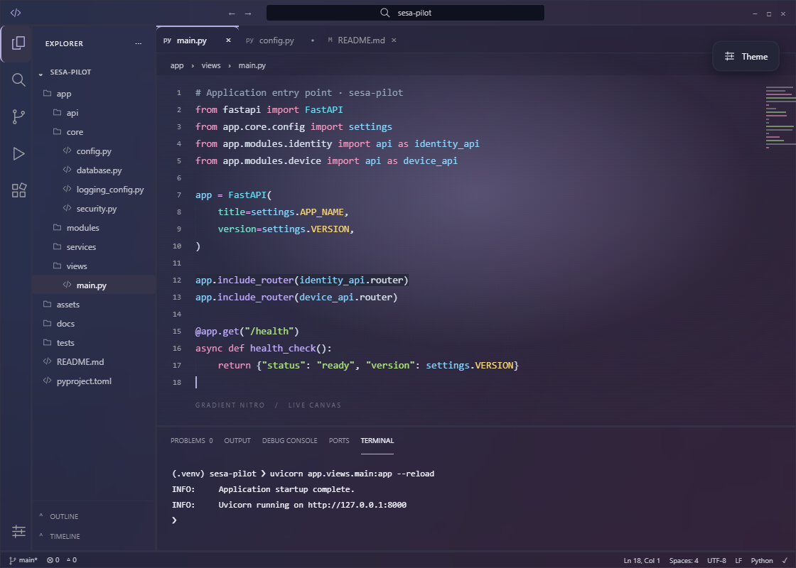
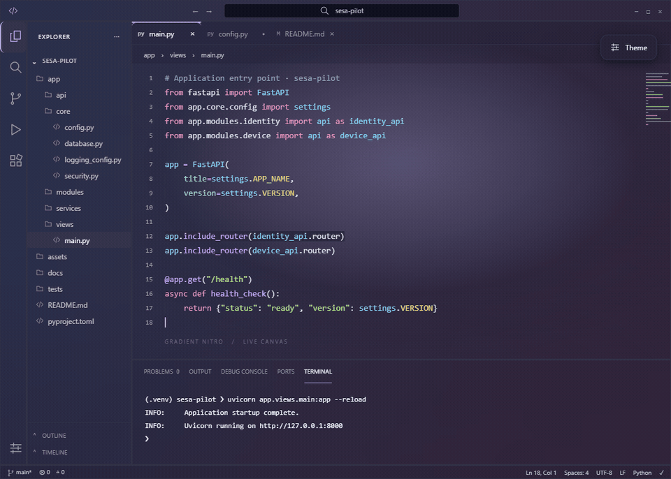
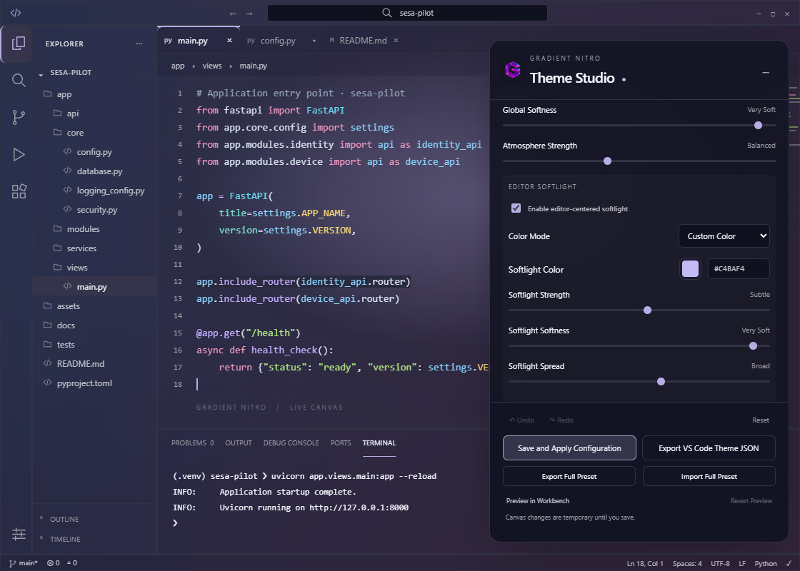
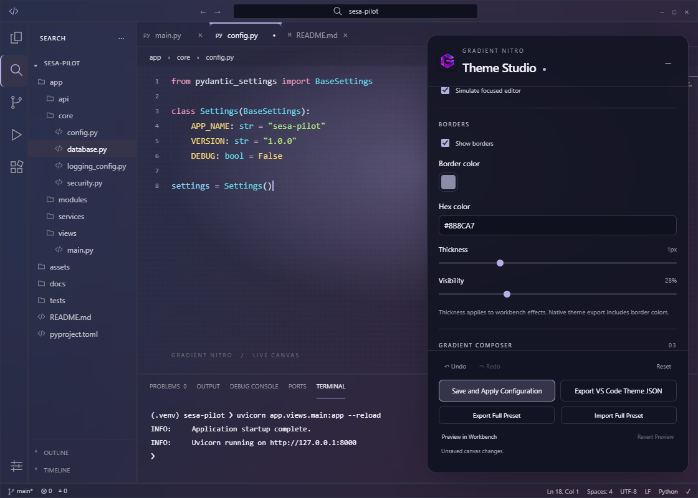

# Gradient Nitro Glass!

**Version 1.5.3 · Tested on desktop VS Code 1.136.1**

Build a workspace with one continuous gradient across the editor, Explorer, terminal and surrounding panels. Theme Studio combines Base + Accent colors, glass, softlight, adjustable borders and responsive interaction effects in a live preview.

[Marketplace](https://marketplace.visualstudio.com/items?itemName=dadayan1234.gradient-nitro-glass) · [Releases & VSIX](docs/release-versions.md) · [Changelog](CHANGELOG.md) · [Issues](https://github.com/dadayan1234/gradient-nitro/issues)

## See it in motion



The release preview uses **Midnight Studio**: two custom stops, midnight indigo `#243B61` and muted plum `#51344F`, with broad lavender softlight. [Import the complete preview preset](docs/midnight-studio.gradient-nitro.json) through **Import Full Preset** to use these exact settings.



This GIF records the Studio canvas: softlight adjustments, hover/press transitions and selected items. The still image above remains useful when a viewer does not animate GIFs. [Open the animation directly](https://raw.githubusercontent.com/dadayan1234/gradient-nitro/main/docs/images/theme-studio-motion-1.5.3.gif). Motion respects the system's reduced-motion preference.



## Install and open the side menu

1. Open the Command Palette (`Ctrl+Shift+P` on Windows/Linux, `Cmd+Shift+P` on macOS).
2. Run **Extensions: Install from VSIX…** and select `release/gradient-nitro-glass-1.5.3.vsix` from this repository or the downloaded file from GitHub Releases. Reload VS Code if requested.
3. Run **Preferences: Color Theme** and choose **Gradient Nitro Glass** or **Gradient Nitro Glass Light**.
4. Click the **Gradient Nitro** icon in the Activity Bar, beside Explorer, Search and Source Control. This opens the **Theme Studio** side menu.
5. Click **Open Theme Studio** in that menu to open the full editor preview.

If the icon is hidden, right-click the Activity Bar and enable **Gradient Nitro**. You can also run **Gradient Nitro: Open Theme Customizer** directly from the Command Palette.

For installation from a terminal:

```sh
code --install-extension release/gradient-nitro-glass-1.5.3.vsix
```

Upgrading retains saved configuration. You do not need to reset your theme. To download `.vsix` packages for current or previous versions directly from GitHub Releases, see the [Release Versions & Feature Log](docs/release-versions.md) table.

## Configure, save and apply

1. In Studio, choose Base and Accent colors or a preset.
2. Enable **Render effects in VS Code** for real workbench gradients, glass and motion.
3. Adjust gradient stops, softlight, borders and other effects. **Preview in Workbench** temporarily applies the draft when runtime effects are already enabled.
4. Click **Save and Apply Configuration** at the bottom of Studio to persist the entire draft and apply it to VS Code.
5. On the first runtime installation, follow the **Reload Window** prompt. Open Studio again whenever you want to make changes.

The Gradient Nitro side menu also includes **Save and Apply Configuration** and a save icon in its title toolbar. While Studio is open, these save its current draft, including unsaved edits. When Studio is closed, they reapply the saved configuration.

The side menu shows Base, Accent and runtime status. **Apply Saved Theme**, **Preview Saved Theme** and **Revert Preview** are also available there. These actions are available from the Command Palette.

## Feature highlights

| Feature | What you can adjust |
| --- | --- |
| Continuous gradient | 2–8 color stops, position, opacity, individual softness, global softness, strength and 0–360° direction |
| Base + Accent harmony | Shared perceptual OKLCH palette and five presets: Nitro Aqua, Mint, Electric Violet, Nitro Pink and Electric Blue |
| Explorer and terminal glass | Translucent pane layers reveal the same backdrop in classic and Modern UI layouts |
| Readable interaction states | Distinct hover/selection fills and contrast-adjusted text across file lists, tabs, menus and navigation |
| Borders | Color picker or hex input, 0–4px thickness, visibility and an enable/disable switch |
| Editor softlight | Independent radial light with Auto, Accent or Custom color, strength, spread and softness |
| Glass and neon | 0–40px blur, opacity, saturation, plus adjustable glow on active signals |
| Spring motion | Hover expansion, press compression, strength and spring response; reduced-motion support |
| Complete presets | Export/import the full visual configuration, including gradient, border and effect settings |
| Typography and syntax | Font family, size, weight, line height, ligatures and explicit syntax overrides |
| Flexible controls | Draggable panel, collapse/expand, responsive narrow layout and Undo/Redo |



Drag the Studio header to move its controls; double-click the header to restore their position. Collapse with the minus button or Escape, then reopen with the floating **Theme** button. Narrow windows use a bottom sheet.

## Actions and persistence

| Action | Result |
| --- | --- |
| Edit a control | Updates the Studio canvas; does not save settings |
| Save and Apply Configuration | Saves the complete versioned configuration and applies colors, typography, layout and enabled runtime effects |
| Preview in Workbench | Temporarily previews colors and already-enabled runtime effects |
| Revert Preview | Returns to the saved composition while preserving unrelated manual setting changes |
| Export Full Preset | Saves a portable Gradient Nitro preset containing every visual setting |
| Import Full Preset | Loads a preset into the draft; save to persist it |
| Export VS Code Theme JSON | Exports native colors and syntax; runtime gradients, blur, thickness and motion are not part of native theme JSON |
| Reset in Studio | Resets the draft; Undo can restore it, and the runtime opt-in choice is retained |

Temporary preview reverts when Studio closes, on deactivation, or during recovery after an interrupted session. Changing the draft after preview requires another preview or Save and Apply.

The separate **Gradient Nitro: Reset to Default Settings** and **Clean All Injected Settings & Styles** commands use the settings recovery workflow and switch to Default Dark Modern.

## Real workbench and compatibility


[View the screenshot and animation guide](docs/preview-guide.md) · [Read the runtime verification report](docs/runtime-coverage.md)

Runtime rounding is independent of **Use native Modern UI layout**. Native Modern UI controls its own tab and panel geometry and can hide line indicators. Top and Bottom tab indicators are supported through native colors; Side Line is canvas-only and exports as Top Line.

Standard themes use VS Code's color API. Optional runtime effects install a helper into workbench HTML with backups. VS Code updates may require reinstalling that helper and reloading; integrity notifications can occur. No separate custom-CSS extension is needed. Native operating-system dialogs keep their platform appearance; renderer glass applies to VS Code custom dialogs.

The tested desktop version is **1.136.1**. The extension engine range remains `^1.129.0`; older versions may ignore newer color tokens. Third-party webviews and terminal applications that explicitly paint their own background colors control those surfaces themselves.

## Release versions and GitHub VSIX downloads

All current and past `.vsix` release packages can be downloaded directly from [GitHub Releases](https://github.com/dadayan1234/gradient-nitro/releases) or found locally inside the [`release/`](release/) folder. See the complete [Release Versions & Feature Log](docs/release-versions.md) for full changelogs, VS Code compatibility, and SHA-256 verification hashes.

| Version | Date | Target | Direct VSIX Download | Local Package | Status |
| :--- | :--- | :--- | :--- | :--- | :--- |
| **v1.5.3** | 2026-09-09 | `^1.129.0` (Tested 1.136.1) | [Download v1.5.3 VSIX](https://github.com/dadayan1234/gradient-nitro/releases/download/v1.5.3/gradient-nitro-glass-1.5.3.vsix) | `release/gradient-nitro-glass-1.5.3.vsix` | **Latest Stable** |
| **v1.5.2** | 2026-09-09 | `^1.129.0` (Tested 1.136.1) | [Download v1.5.2 VSIX](https://github.com/dadayan1234/gradient-nitro/releases/download/v1.5.2/gradient-nitro-glass-1.5.2.vsix) | `release/gradient-nitro-glass-1.5.2.vsix` | Stable |
| **v1.5.1** | 2026-09-09 | `^1.129.0` (Tested 1.136.1) | [Download v1.5.1 VSIX](https://github.com/dadayan1234/gradient-nitro/releases/download/v1.5.1/gradient-nitro-glass-1.5.1.vsix) | `release/gradient-nitro-glass-1.5.1.vsix` | Stable |
| **v1.5.0** | 2026-09-08 | `^1.129.0` (Tested 1.136.1) | [Download v1.5.0 VSIX](https://github.com/dadayan1234/gradient-nitro/releases/download/v1.5.0/gradient-nitro-glass-1.5.0.vsix) | `release/gradient-nitro-glass-1.5.0.vsix` | Stable |

👉 **[View all 19 releases and detailed feature log in docs/release-versions.md](docs/release-versions.md)** · **[Explore local release/ directory](release/README.md)**

## Development and verification

```sh
npm install
npm test
npm run lint
npm run test:customizer
npm run package
node scripts/check-parity.cjs
```

The packaged integration suite uses an isolated VS Code application copy and profile. It checks Save/reload, Explorer and terminal transparency, hover/selection text contrast, floating surfaces, border widths and side-menu actions. Personal VS Code installation hashes are checked before and after the run.

`node scripts/check-parity.cjs --surfaces-only` runs the focused layer/contrast checks. `node scripts/record-demo.cjs` records the documentation GIF using Playwright and a local `ffmpeg` executable. These scripts require the local browser-test and isolated VS Code fixtures described in [the preview guide](docs/preview-guide.md).

Maintainers: follow [the release guide](docs/release-guide.md) to validate the VSIX and public media before Marketplace upload. `npm run release:check` validates the local artifact; `npm run release:media` additionally checks that each Marketplace image is public and matches this release.
