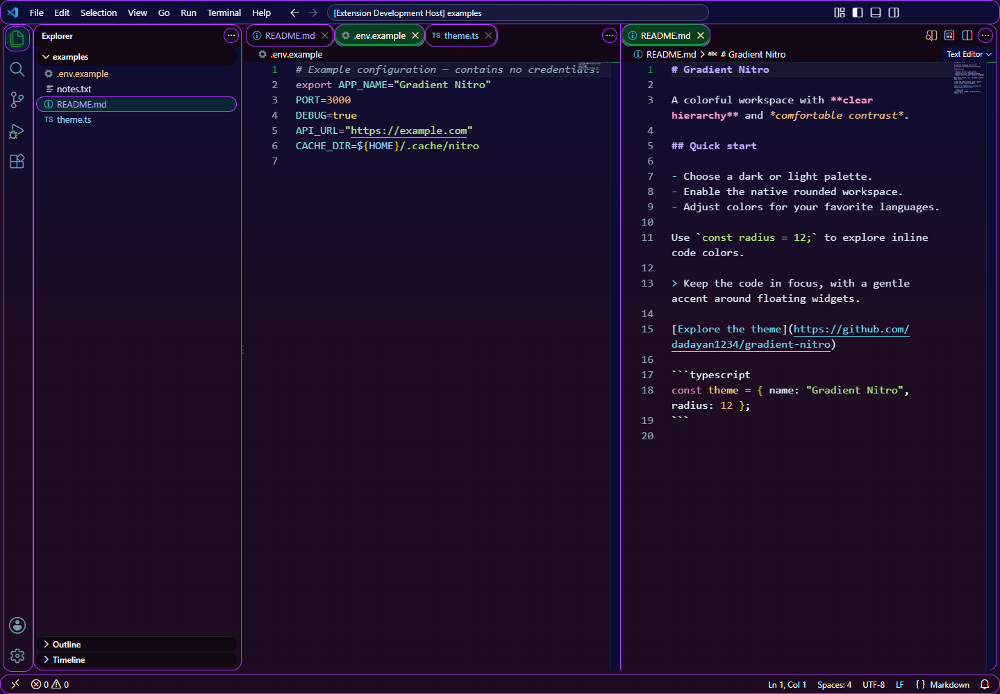
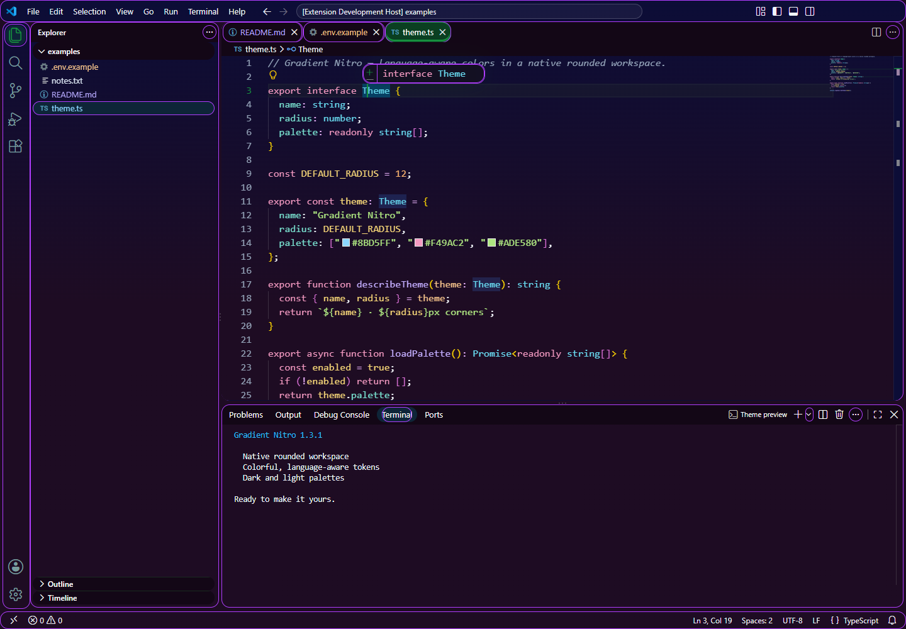
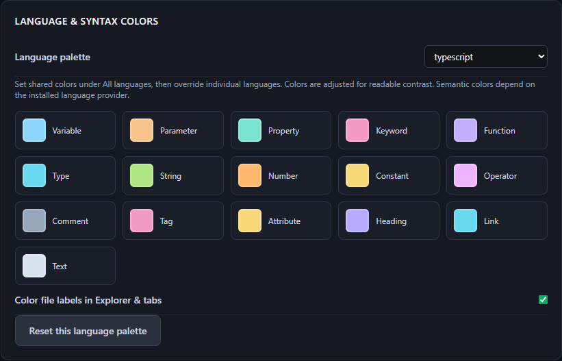

# Gradient Nitro Glass

**An elegant glass and gradient theme for Visual Studio Code.**

A minimal workspace with colorful language-aware syntax, purple dark and light palettes, and a visual customizer. Version **1.3.1** brings gradients into the text editor, adjustable rounded corners, consistent panel borders and independent color intensity for both modes.

[Marketplace](https://marketplace.visualstudio.com/items?itemName=dadayan1234.gradient-nitro-glass) | [Issues](https://github.com/dadayan1234/gradient-nitro/issues) | [Changelog](CHANGELOG.md)

## Preview




Real screenshots from VS Code **1.136.1**, using the included examples and plum `#480f40` and blue `#00118f`, with green accent `#00852c`. The current preview uses Fira Code at 16 px, 13 px corners and 25% dark intensity. Reproduce it with [preview settings](docs/preview-theme.json).

## Install and customize

1. Install **Gradient Nitro Glass Theme**, or use **Extensions: Install from VSIX...** with `gradient-nitro-glass-1.3.1.vsix`.
2. Select **Gradient Nitro Glass** or **Gradient Nitro Glass Light** from **Preferences: Color Theme**.
3. Open the **Gradient Nitro** customizer from the Command Palette.
4. Adjust the palette, accent, dark/light intensity, radius, borders and glow. Apply to VS Code.
5. On first use of live effects, select **Reload Window** when prompted. Later adjustments apply live.

Requires desktop VS Code **1.129.0 or newer**. Live effects modify the installed workbench HTML to load a small helper and require write access to that installation. Original files are backed up in extension global storage. VS Code updates may require reapplying the helper and reloading. Native theme colors remain available with live workbench effects disabled.

## Controls

| Control | Result |
| --- | --- |
| Color stops and direction | Gradient across the workbench and text editor |
| Dark / light intensity | Independent richness; higher values bring out more color |
| Accent | Contrasting navigation icons, active states and buttons |
| Show borders | Bordered or borderless panels and controls |
| Border color / thickness | Consistent inset strokes without changing spacing |
| Rounded corners / radius | Live radius for panels, tabs, inputs and widgets |
| Glow intensity / spread | Live widget elevation; zero removes glow |
| Glass blur / opacity | Translucent floating widgets with adjustable backdrop blur |
| Editor typography | Apply font family, size, line height, weight and ligatures |
| Surprise me | Generate a fresh palette to preview and apply |

Keyboard focus indicators remain visible in borderless mode. Operating-system dialogs and third-party extension webviews have separate styling. Typography controls apply editor font family, size, line height, weight and ligatures. Reset or leaving Nitro restores previous preferences while preserving later manual edits. Workspace and language-specific overrides retain precedence. Fonts must be installed on your system.

## Colorful syntax

Panel headers use a darker surface. Active editor tabs have an accent-tinted fill, a visible underline and contrast-adjusted text, including the Modern UI tab fill.



Customize variables, parameters, keywords, functions, types, strings, numbers and comments by language. Select a language in the syntax studio, adjust its palette, then Apply. **Reset this language palette** clears draft overrides for that language.



Supported families include JavaScript/TypeScript, Python, Dart, Go, Rust, Java, C/C++, C#, PHP, Ruby, Swift, Kotlin, shell, PowerShell, SQL, HTML/Vue, CSS, JSON, YAML, TOML, Markdown, environment files and plain text. Language extensions supply semantic information where available. Bundled grammars color environment and plain-text tokens; Explorer decorations distinguish file families.

Token colors are adjusted for readability across the gradient. Use **Developer: Inspect Editor Tokens and Scopes** to inspect the tokens provided by your language extension.

```json
{
  "gradientNitro.darkIntensity": 0.8,
  "gradientNitro.lightIntensity": 0.75,
  "gradientNitro.borderEnabled": true,
  "gradientNitro.borderColor": "#b45cad",
  "gradientNitro.borderWidth": 1,
  "gradientNitro.borderRadius": 24,
  "gradientNitro.syntaxOverrides": {
    "typescript": { "variable": "#bbaaff", "keyword": "#ff82c4" }
  }
}
```

After editing settings, open the customizer and Apply.

## Reset and recovery

Run the **Gradient Nitro** reset or clean-settings command to restore **Dark Modern**, remove the helper and restore settings owned by Nitro. Later manual edits are preserved where ownership can be determined.

The helper receives styles from a local extension session. Switching themes, stopping or removing the extension disconnects that session and removes live styles. A heartbeat timeout clears styles after unexpected disconnection. An inert helper may remain after uninstall; use Reset before uninstalling to remove it from disk.

Legacy Nitro CSS blocks are backed up and removed during migration. Reload once to clear old styles already loaded in memory. Very old versions did not record every replaced preference, so those values cannot always be reconstructed.

If effects are missing, enable live effects, Apply and reload once. Installation write errors appear in notifications. Workspace overrides take precedence over user settings. For environment files, check the language mode and `files.associations`.

## Development

```sh
npm install
npm test
npm run themes:generate
npm run package
```

`scripts/check-vscode.cjs` uses Playwright and a separate VS Code copy with an isolated profile to verify rendering and capture screenshots. It does not install the extension into your regular profile.

Logo: a geometric glass monogram generated with the built-in imagegen tool. See [asset provenance](docs/logo-provenance.md).

[MIT](LICENSE.md) | dadayan1234
