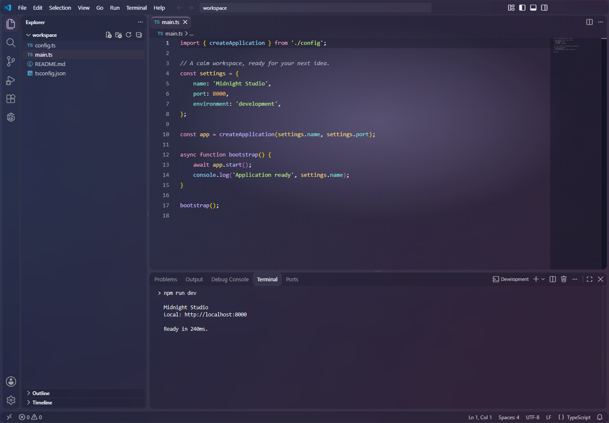
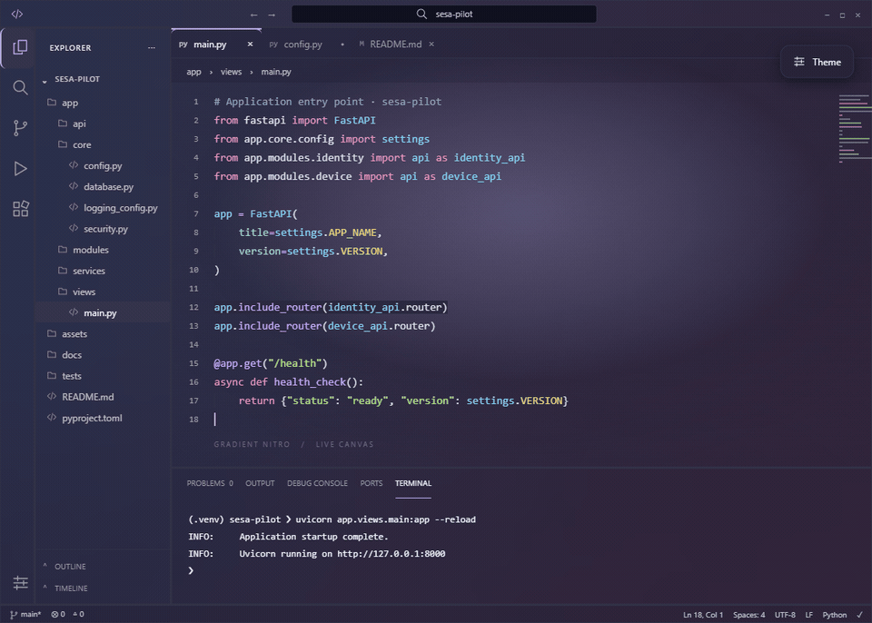
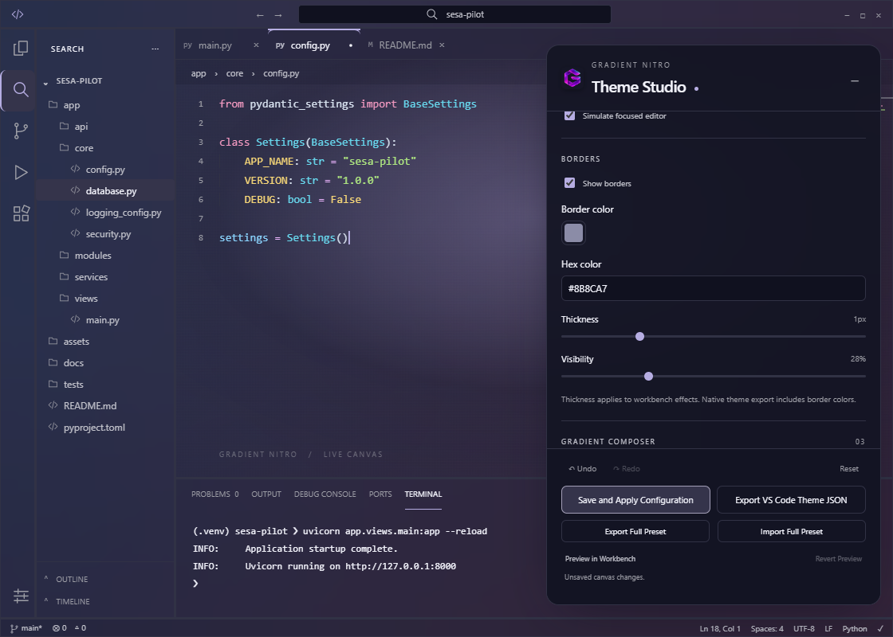

# Gradient Nitro Glass

**A clean gradient glass theme for VS Code and Google Antigravity.** Bring a continuous, elegant gradient to your editor, Explorer, terminal, and panels. Frosted glass, subtle editor softlight, and readable dark and light palettes make the workspace feel calm without losing contrast.

Choose a theme and start coding immediately. Open the live **Theme Studio** when you want to shape the colors and effects yourself.

For a ready-made setup, select the new **Dark Purple** full template in Theme Studio. It brings a two-stop violet gradient, gentle white softlight, subtle pink borders, and a complete typography and interaction setup. [Download the full preset JSON](docs/dark-purple.gradient-nitro.json) to import or share it.

[Install from VS Code Marketplace](https://marketplace.visualstudio.com/items?itemName=dadayan1234.gradient-nitro-glass) · [Download a VSIX](https://github.com/dadayan1234/gradient-nitro/releases) · [Changelog](CHANGELOG.md) · [Report an issue](https://github.com/dadayan1234/gradient-nitro/issues)

## Watch the theme in action

The **Midnight Studio** preview uses just two muted gradient stops—indigo `#243B61` and plum `#51344F`—with a soft lavender editor light. [Import the preview preset](docs/midnight-studio.gradient-nitro.json) to try its exact settings.

[Open the GIF directly](https://raw.githubusercontent.com/dadayan1234/gradient-nitro/main/docs/images/theme-studio-motion-1.5.3.gif) if it does not play in your extension store. The [still preview](docs/images/theme-studio-motion-poster.png) shows the same look without animation. Motion respects your reduced-motion preference.

## What you can make

| Feature | What it brings to your workspace |
| --- | --- |
| Continuous gradient | A cohesive background across the editor and surrounding workbench, with 2–8 adjustable stops |
| Frosted glass | Translucent Explorer, terminal, and panel surfaces with adjustable blur and opacity |
| Soft editor lighting | A broad radial glow with its own color, strength, spread, and softness |
| Clean, readable colors | Perceptual Base + Accent palette, dark and light variants, and contrast-aware interaction states |
| Live Theme Studio | Instant preview, presets, Undo/Redo, and complete preset import/export |
| Finishing details | Adjustable border color and thickness, syntax colors, typography, and optional spring motion |

The native color theme works as soon as you select it. Continuous workbench gradients, glass, and motion are **optional runtime effects**; enable them in Theme Studio and save to apply them.

## Install and open Theme Studio

1. In VS Code or Antigravity, open **Extensions** and search for **Gradient Nitro Glass Theme**. Install it, or [download a VSIX](https://github.com/dadayan1234/gradient-nitro/releases) and run **Extensions: Install from VSIX…** from the Command Palette.
2. Run **Preferences: Color Theme** and choose **Gradient Nitro Glass** or **Gradient Nitro Glass Light**.
3. Select the **Gradient Nitro** icon in the Activity Bar, next to Explorer and Source Control. This opens the Theme Studio side menu; choose **Open Theme Studio** for the full editor preview.
4. Pick **Dark Purple** for the complete template, choose another preset, or adjust Base, Accent, gradient stops, softlight, glass, and borders. Enable **Render effects in VS Code** if you want the gradient and glass across the actual workbench.
5. Select **Save and Apply Configuration** to keep your changes. Follow the **Reload Window** prompt on first activation of runtime effects.

If the icon is hidden, right-click the Activity Bar and enable **Gradient Nitro**. You can also run **Gradient Nitro: Open Theme Customizer** from the Command Palette. The side menu offers quick access to save, apply, preview, and revert actions.

**Preview in Workbench** temporarily applies the draft; **Save and Apply Configuration** persists the whole setup. Export a **Full Preset** to share all visual settings. Exporting **VS Code Theme JSON** includes native colors and syntax, while runtime effects stay in the extension configuration.

## Runtime effects and compatibility

Runtime effects install a helper into the local VS Code or Antigravity workbench, with backups and recovery. An IDE update can require reapplying the helper and reloading, and the IDE may show an integrity notification. The native color themes remain available without runtime effects. Third-party webviews or terminal apps that paint their own backgrounds can cover the gradient in their surfaces.

The extension supports VS Code API `^1.80.0` and has been tested on desktop VS Code 1.107.0–1.136.1 and Google Antigravity. See the [preview and installation guide](docs/preview-guide.md) and [runtime coverage](docs/runtime-coverage.md) for screenshots and detailed verification.

## License and contributing

Gradient Nitro Glass **v1.6.0 and later** is licensed under the [PolyForm Noncommercial License 1.0.0](LICENSE.md). Releases through **v1.5.3** remain under their original MIT license; the [license change notice](RE-LICENSING.md) explains the version boundary. The [Contributor License Grant](CONTRIBUTING.md) governs contributions separately from the license for users.

For version history and verified VSIX downloads, see the [release versions](docs/release-versions.md). Maintainers can use the [release guide](docs/release-guide.md) for build and publication checks.
