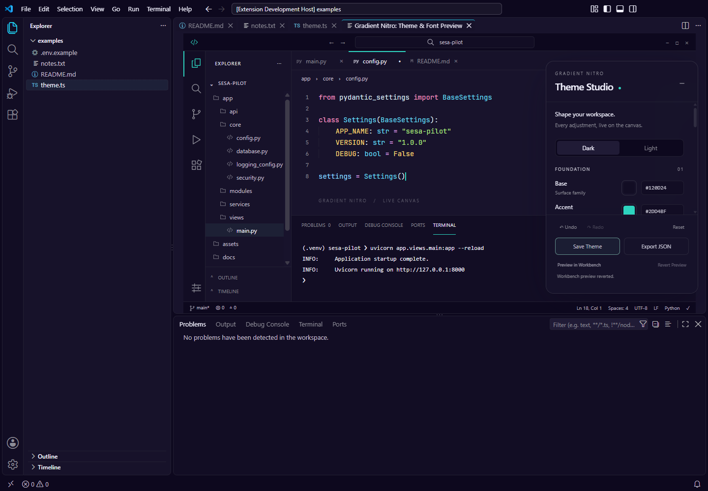
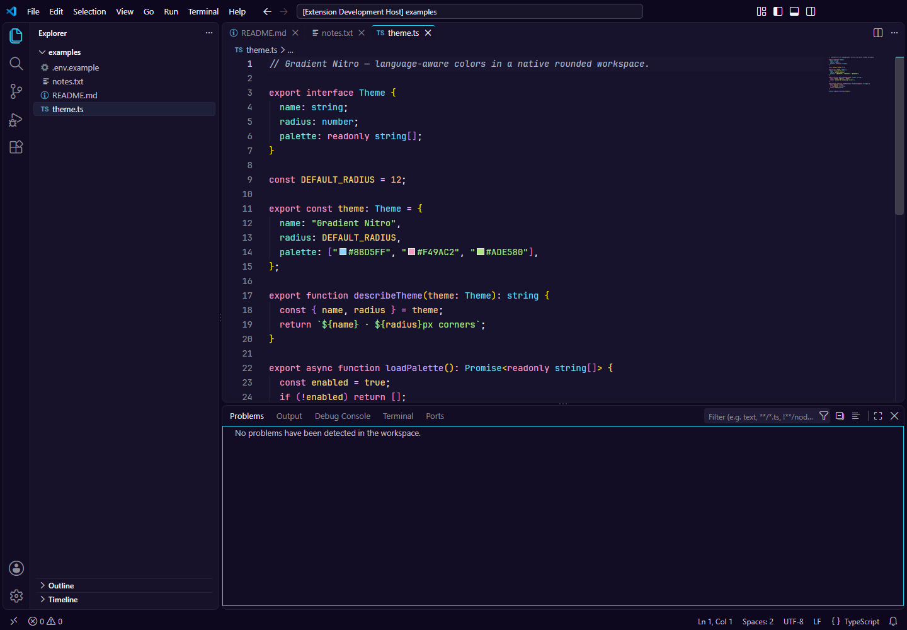
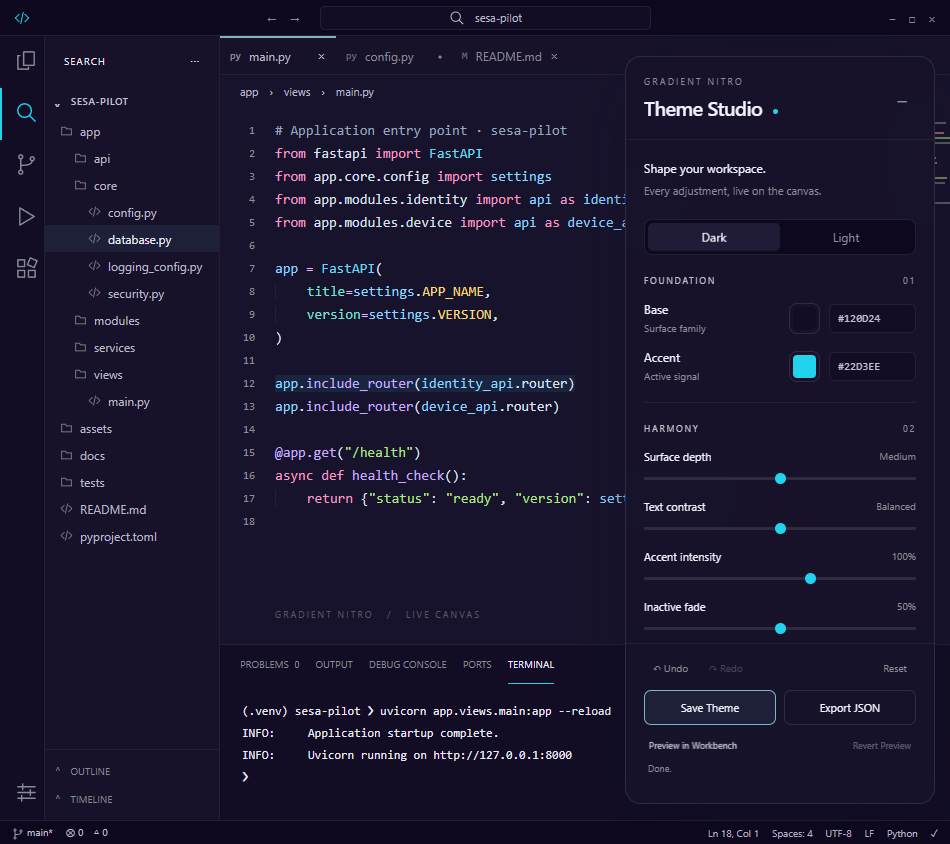
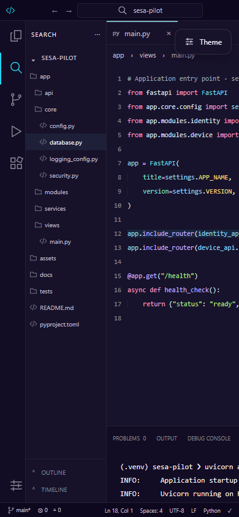

# Theme Studio 1.4.0 previews

These screenshots show the current Theme Studio and VS Code 1.136.1. Native screenshots are captured in a separate Extension Development Host profile; the browser canvas screenshots use the same Webview code. No workbench CSS is injected for capture.

## Open and customize

Install `gradient-nitro-glass-1.4.0.vsix` with **Extensions: Install from VSIX…**, then run **Gradient Nitro: Open Theme Customizer** from the Command Palette.

Use Base and Accent to set the palette, then refine Harmony. The overlay scrolls to reveal presets, generated swatches, diagnostics and typography/syntax controls. Editor tabs, navigation, tree rows and bottom-panel tabs respond to clicks.

**Save Theme** persists and applies the current configuration. **Preview in Workbench** is temporary; **Revert Preview** or closing the customizer restores preceding colors. **Export JSON** writes a standalone theme to your chosen location. **Reset** affects the draft until Save.

## Inside VS Code

This screenshot is the actual extension Webview hosted inside VS Code. The integration check changes the accent to Mint and exercises the Preview/Revert buttons.

Native dark and light workbenches use the default palette and standard layout:

Modern UI remains optional. Its additional theme tokens keep active fills restrained, but VS Code controls its geometry and can suppress the normal line indicators.

## Responsive controls

At medium widths the right overlay becomes more compact:

At narrow widths it becomes a bottom sheet. Scroll inside it to access all controls:

Collapse with the minus button or Escape; **Theme** reopens the controls:

## Reference palette and capture

[preview-theme.json](preview-theme.json) contains the current Nitro Aqua reference settings. After editing settings directly, open Theme Studio and Save to regenerate the workbench colors. Existing workspace overrides and explicit file-color/Modern UI choices can change the appearance.

Run `npm run previews:refresh` to execute both checks and publish the resulting screenshots to this directory. This requires the local Playwright tools and installed VS Code 1.136.1 used by the test scripts. Capture compares installation hashes before/after. `scripts/capture-guide.cjs` is now a compatibility entry point for this same workflow.

Older screenshots of gradient effects remain historical repository assets and are excluded from the 1.4.0 package. They do not represent the current customizer.
