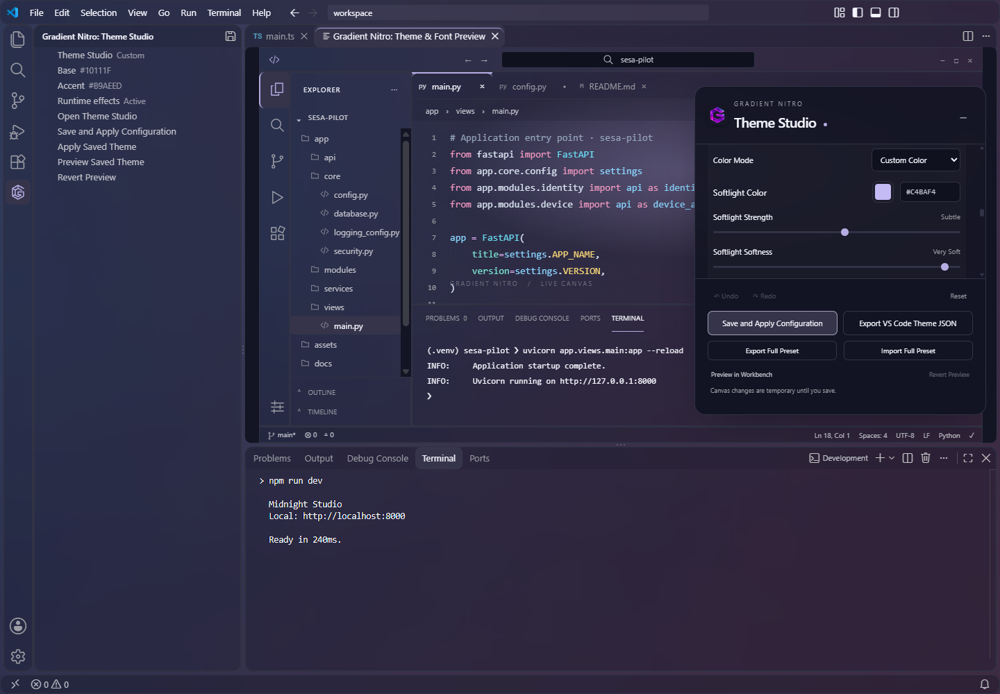
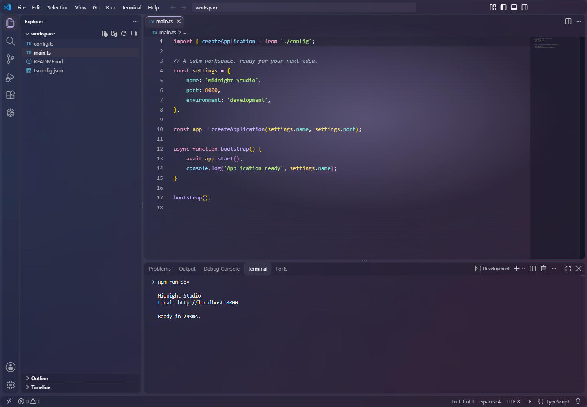

# Theme Studio 1.5.3: access, screenshots and animation

## Open the side menu

Install `gradient-nitro-glass-1.5.3.vsix`, then select a Gradient Nitro theme. Click **Gradient Nitro** in the Activity Bar to open its **Theme Studio** side menu. If the icon is hidden, right-click the Activity Bar and enable Gradient Nitro.



Click **Open Theme Studio**. The same action is available as **Gradient Nitro: Open Theme Customizer** in the Command Palette.

The side menu shows saved Base and Accent colors, runtime status, and actions to Save and Apply, Apply Saved, Preview Saved and Revert Preview. The save icon in the side-menu header invokes **Save and Apply Configuration**.

With Studio open, Save and Apply submits the current draft. With Studio closed, it reapplies saved settings. Enable **Render effects in VS Code** in Studio, save, and follow the first-use Reload Window prompt to activate the runtime helper.

## Edit borders and effects


Choose a border color with the picker or hex input, set thickness from 0–4px, and adjust visibility. Turning off **Show borders** keeps the chosen values for later use. Visibility changes preserve thickness.

Other sections control the Base + Accent palette, gradient stops, editor softlight, glass, neon, spring motion, typography and syntax. Drag the header to move the controls; double-click to restore their position. Collapse with the minus button or Escape, then reopen with **Theme**.

**Preview in Workbench** is temporary. **Save and Apply Configuration** persists the full configuration. **Export Full Preset** includes visual effects; **Export VS Code Theme JSON** contains native colors and syntax.

## Recorded interaction demo


This 960px-wide GIF records the actual Studio canvas at 12 frames per second. It demonstrates softlight adjustments, hover/press motion and item selection while retaining exactly two gradient stops. The still-image fallback appears in the README. It is a canvas recording; the screenshots below come from the installed extension in VS Code. Reduced-motion preferences disable runtime motion.

## Explorer and terminal verification



Release captures use the same Midnight Studio palette: two muted indigo/plum stops and custom lavender softlight. Explorer, editor and terminal share the gradient in Modern UI. The separate regression suite still uses diagnostic colors to detect background blocking; those colors are not published as product previews.

The terminal check compares a blank pixel with its canvas visible and hidden. Matching pixels confirm the renderer is not painting an opaque background over the gradient. Hover, selection and active-tab labels are checked against their rendered backgrounds at a minimum 4.5:1 contrast ratio.


## Reproduce the captures

The fixture uses VS Code 1.136.1 in `.vscode-test/code`, plus Playwright at `%TEMP%/gradient-nitro-browser-check/node_modules/playwright` or the path supplied through `PLAYWRIGHT_MODULE`. Browser-only captures use installed Microsoft Edge. The application tests install the local VSIX into a separate profile and extensions directory; they verify personal installation file hashes remain unchanged.

```sh
npm run test:customizer
npm run package
node scripts/check-parity.cjs
node scripts/check-parity.cjs --release-preview
node scripts/record-demo.cjs
node scripts/refresh-previews.cjs
```

The last command requires `ffmpeg` on PATH. It records Chromium screencast frames, uses their timestamps to preserve timing, and produces `theme-studio-motion-1.5.3.gif` plus `theme-studio-borders.png`. No generated animation is substituted for product behavior.

`node scripts/check-parity.cjs --surfaces-only` runs focused transparency and contrast checks. Full-run screenshots and JSON measurements are stored in `.vscode-test/parity-*`; `.vscode-test/latest-parity.txt` identifies the newest run. See [runtime coverage](runtime-coverage.md) for the verified build and results.

`npm run previews:refresh` records the shared release palette and copies only verified release captures, preserving diagnostic images as test artifacts. Build the matching VSIX first, then rebuild it after refreshing media. Historical 1.5.0 implementation notes remain in [theme-studio.md](theme-studio.md); the README and this guide describe the current interface. See the [release guide](release-guide.md) for public image and GIF checks.
